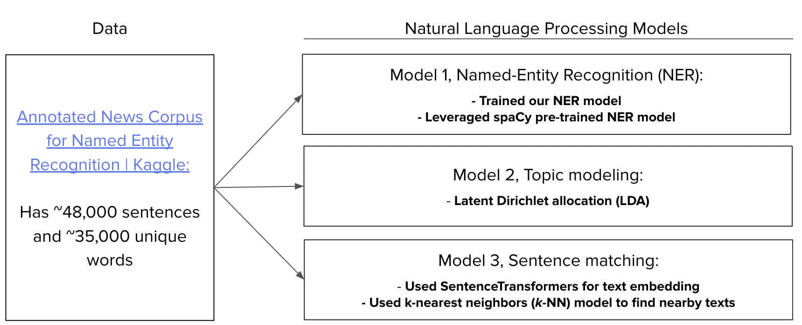
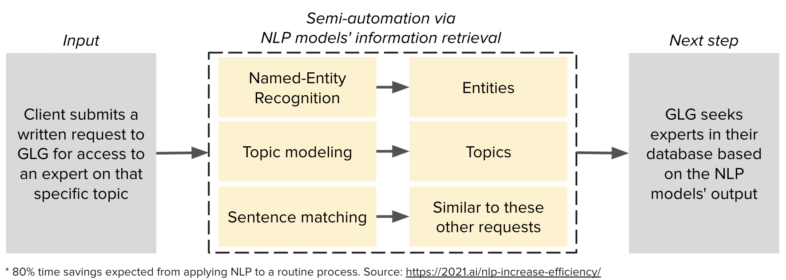

# 🚀 [GLG](https://glginsights.com/) project

We are [Ying Hu](https://www.linkedin.com/in/ying-hu-math/), [Cody McCormack](https://www.linkedin.com/in/codymccormack/) and [Cris Fortes](https://www.linkedin.com/in/crisfortes/). This repo is part of our capstone project of [FourthBrain](https://fourthbrain.ai/)'s [Machine Learning Engineer Program](https://fourthbrain.ai/courses/machine-learning-engineer/), from August to December of 2022.


## Context

[GLG](https://glginsights.com/)'s business largely revolves around **matching clients**, requesting insights on a specific topic, **with an expert** on that topic from their large database so that they can meet by phone, video or in person.  Since they receive hundreds of these requests per day, we wanted to use machine learning to help automate and scale the process. 


We used NLP models to extract useful informations from the requests. You can find a recording of our presentation here: [Presentation](https://youtu.be/roA-0QMAdJQ) and [Slide Deck](https://github.com/LaplaceCherub/glg-project/blob/main/Presentation/FourthBrain%20MLE%20Capstone%20Presentation%20-%20GLG%20-%2020221206.pdf).


## Application Demo

Our application takes a textual input and then outputs its key words, a list of possible related topics, and a list of similar sentences from our database. The application was deployed on AWS, but we took it down after the program. You can watch an HD product demo here: 

[HD Project Demo link on Youtube](https://youtu.be/H9BZQdG0qCA).

<br>


<br>

## Deployment Instructions

This app can be easily deployed using [Docker](https://www.docker.com/). The instructions to deploy in the cloud or locally are the same.

1. Clone this repository, either on a local machine or in a cloud instance

2. Navigate to the flask_app folder

3. Build the Docker image, using the command 

```bash
docker build -t <image_name> .
```

4. If you don't have Docker installed locally or in the cloud instance, you will have to [install](https://docs.docker.com/get-docker/) and [activate](https://docs.docker.com/config/daemon/systemd/) the Daemon in order to build a Docker image.
  
5.  Run the Docker image using the command 

```bash
docker run -d --rm --name <container_name> -p 8000:8000 <image_name>
```

6.  Navigate to either your local host, port 8000, or the public IP of the cloud instance, port 8000. E.g. 127.0.0.0:8000 

**NOTE:** This application depends on prebuilt machine learning models that were saved using [Pickle](https://docs.python.org/3/library/pickle.html) files. The idea of Pickle files is that they can be built once and ported to any other machine. However, in testing we found that the app may crash when you try to run it and this is most likely caused by the 'pkl files'. Unfortunately, to resolve the issue, you need to take the steps below to remediate the issue. This will slow down the Docker image build considerably, and might take up to 20 minutes, depending on your machine.

- Open `Dockerfile`, and remove the `#` from the 3rd line from the bottom, so that it reads `RUN python model_maker.py`
- Then you can pick up from the step 3 above.


## Data, models and results

<br>



<br>



<br>

## Future work

1. Improve the Topic Modeling: 
- Training an LDA model on a more diverse [dataset](https://components.one/datasets/all-the-news-2-news-articles-dataset/)
- Using semi-supervised learning method (SentenceTransformers + Label Propagation)

2. Expand the scope of the project: 
- Building the expert(s) recommendation model 
- Adapting our models to cover non-English languages 
  (GLG also has offices in Europe, Asia, and the Middle East)


## License

MIT License. 
Copyright (c) 2022 Cody McCormack, Cris Fortes and Ying Hu


  
